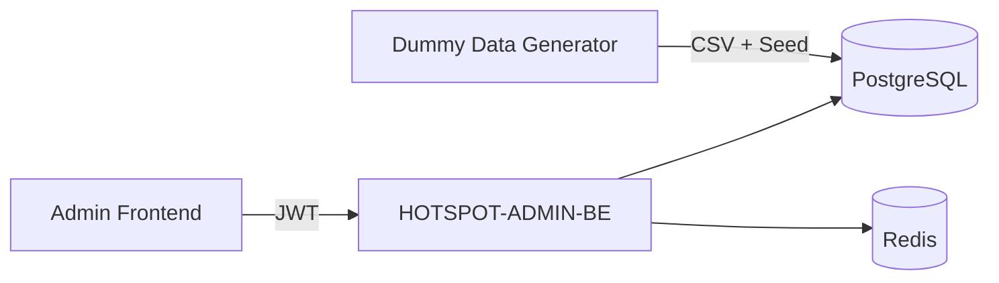
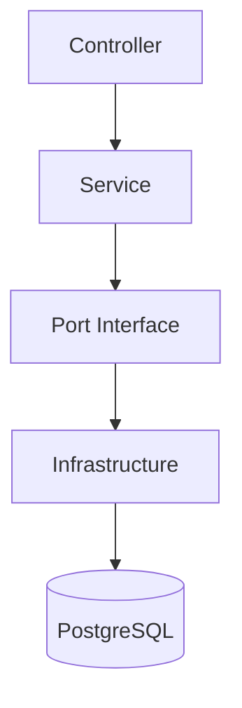
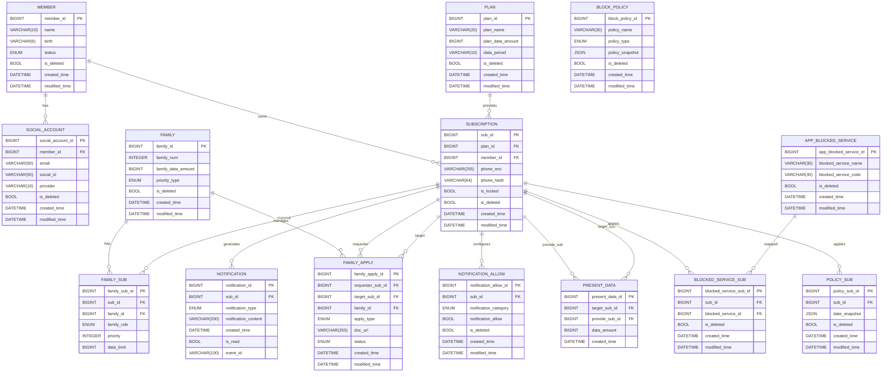

# <h1 align="center">HotSpot 🔥</h1>

  <b>공유는 여기서, 차단은 저기서? NO!!</b>

<b>가족 데이터 공유 + 사용 제어, 흩어진 기능을 하나의 통합 서비스로</b>

 

---
 

## 📝 Overview
ADMIN-BE 레포지토리는 가족 공유 데이터/차단 정책을 운영자가 안전하게 관리할 수 있도록 설계된 백엔드입니다.  
대용량 가입자/회선 데이터를 기반으로 정책 템플릿 운영, 가족 결합 승인 처리, 운영 리포트 제공에 집중합니다.

 

## 📌 목차
[🚀 HotSpot Admin-BE: 관리자 페이지](#admin)
  - [📖 개요](#admin-overview)
  - [👥 관리자 권한 및 역할](#admin-role)
  - [✨ MVP 범위](#admin-mvp)
  - [🛠️ 핵심 운영 정책](#admin-policy)
  - [🏗️ 기술적 설계](#admin-tech)

[💾 데이터베이스 및 ERD](#db)
  - [기준 데이터 사전](#db-dictionary)

[🚀 관리자 페이지 고도화 계획](#plan)
  - [🎯 정책 운영](#plan-policy)
  - [📡 데이터 운영](#plan-data)
  - [👨‍👩‍👧 가족 운영](#plan-family)
  - [🔔 알림 운영](#plan-notification)

 

---
 

## 🚀 HotSpot Admin-BE: 관리자 페이지

**가족 공유 데이터, 정책 템플릿, 신청 승인 흐름을 통합 운영하는 핵심 API 서비스**

 

## 📖 개요
서비스의 **운영자 접점(Admin Web)을 지원하는 백엔드 서버**

### 1) 주요 역할
* 관리자 인증 및 권한 기반 API 접근 제어
* 가족 조회/검색 및 운영 대상 식별
* 정책 템플릿 관리 및 회선 단위 정책 적용 이력 관리
* 가족 신청/삭제 요청 승인 처리
* 운영 현황 모니터링 및 리포트 제공

### 2) 설계 지향점
* **도메인 중심 설계**: 가족/회선/정책 도메인 분리로 확장성 확보
* **보안 강화**: JWT 인증 + 전화번호 암호화/해시 기반 조회
* **대용량 대응**: 커서 기반 조회, 집계/인덱스 전략
* **감사 가능성**: 정책 변경/승인 이력 추적 가능한 운영 모델

 

---
 

## 👥 관리자 권한 및 역할
민감 액션은 추적 가능성을 전제로 운영합니다.

### 🛡️ 1) ADMIN
* 관리자 코드 기반 로그인/JWT 인증
* 가족 목록 조회 및 전화번호 기반 회선 검색
* 정책 템플릿 생성/수정/삭제
* 가족 결합/해제 요청 승인/반려
* 운영 리포트 조회 및 이상 징후 모니터링

 

---
 

## ✨ MVP 범위

### 1) 1차 MVP
* 관리자 로그인
* 가족 리스트 조회
* 가족별 데이터 사용량 및 정책 조회
* 정책 템플릿 생성/조회/수정/삭제(CRUD)
* 가족 신청/삭제 요청 조회 및 수락/거절 API
* 가족 상세 운영 대시보드(구성원/요금제/정책/사용량 통합)

### 2) 2차 MVP
* 정책 템플릿 버전 관리 및 롤백
* 회선별 정책 적용 이력 추적
* 앱 차단 정책 일괄 적용/해제
* 운영 감사 로그(Audit Log) 및 변경 이력 조회
* 운영 지표 대시보드(정책 적용률, 승인 처리량, 차단 통계)

 

---
 

## 🛠️ 핵심 운영 정책

### 1) 정책 2계층 관리
* **템플릿 정책(`BLOCK_POLICY`)**: 운영 표준 정책 등록/관리
* **회선 적용 정책(`POLICY_SUB`)**: 실제 적용 시점 스냅샷 저장

### 2) 가족 요청 승인 워크플로우
* 요청 상태: `PENDING`, `APPROVED`, `REJECTED`, `CANCELED`
* 승인/반려 이력과 근거를 추적 가능한 형태로 관리

### 3) 개인정보 보호 정책
* 전화번호는 `phone_enc(AES)` + `phone_hash(HMAC)` 이중 구조
* 검색은 해시 기반, 응답 표시는 복호화 후 마스킹

### 4) 정책/서비스 사전 기반 운영
* 요금제/앱 서비스/정책 템플릿 마스터 데이터를 기준으로 정책 운영

 

---
 

## 🏗️ 기술적 설계

### 시스템 아키텍처

### 레이어 구조

 

---
 

## 💾 데이터베이스 및 ERD

### 기준 데이터 사전

#### 요금제
| 요금제명 | 데이터 제공량 | 제공량 기준 |
| --- | --- | --- |
| 5G 시그니처 | 무제한 | MONTH |
| 5G 스탠다드 | 150GB (=157286400KB) | MONTH |
| 5G 베이직+ | 24GB (=25165824KB) | MONTH |
| LTE 데이터 33 | 1.5GB (=1572864KB) | MONTH |
| LTE 다이렉트 45 | 매일 1GB (=1048576KB) | DAY |

#### 앱 서비스
| 서비스명 | 서비스 분류 | 서비스 코드 |
| --- | --- | --- |
| 카카오톡 | 메신저 | `MSG_KAKAO` |
| 라인 | 메신저 | `MSG_LINE` |
| 유튜브 | 미디어 | `MEDIA_YOUTUBE` |
| 넷플릭스 | 미디어 | `MEDIA_NETFLIX` |
| 치지직 | 미디어 | `MEDIA_CHZZK` |
| 숲 | 미디어 | `MEDIA_SOOP` |
| 인스타그램 | SNS | `SNS_INSTAGRAM` |
| 틱톡 | SNS | `SNS_TIKTOK` |
| 페이스북 | SNS | `SNS_FACEBOOK` |
| EBS | 학습 | `STUDY_EBS` |
| 메가스터디 | 학습 | `STUDY_MEGA` |
| 업비트 | 금융 | `FIN_UPBIT` |
| 키움증권 | 금융 | `FIN_KIWOOM` |
| 크롬 | 웹브라우저 | `WEB_CHROME` |
| 사파리 | 웹브라우저 | `WEB_SAFARI` |
| 롤토체스 | 게임 | `GAME_TFT` |
| 모바일 배그 | 게임 | `GAME_PUBG_M` |
| 네이버웹툰 | 웹툰 | `TOON_NAVER` |
| 카카오웹툰 | 웹툰 | `TOON_KAKAO` |
| 데이터 선물하기 | 선물 | `PRESENT_DATA` |

#### 정책 템플릿 예시
| 정책 종류 | 시간 | 정책 유형 | 정책 스냅샷 |
| --- | --- | --- | --- |
| 수면모드 | 매일 00:00 ~ 07:00 | SCHEDULED | `{"days":["MON","TUE","WED","THU","FRI","SAT","SUN"],"startTime":"00:00","endTime":"07:00"}` |
| 방해 금지 모드 | 3시간 | ONCE | `{"durationMinutes":180}` |
| 수업 집중 모드 | 주중 09:00 ~ 14:00 | SCHEDULED | `{"days":["MON","TUE","WED","THU","FRI"],"startTime":"09:00","endTime":"14:00"}` |
| 시험 기간 집중 모드 | 06:00 ~ 23:59 | ONCE | `{"startTime":"06:00","endTime":"23:59"}` |

 

---
 

## 🚀 관리자 페이지 고도화 계획

### 🎯 1) 정책 운영
* 정책 템플릿 생성/수정/배포 워크플로우
* 정책 변경 이력 저장/조회 및 변경 Diff 비교
* 다중 정책 템플릿 번들(버전) 관리
* 템플릿 일괄 적용 및 회선 단위 예외(Override) 관리

### 📡 2) 데이터 운영
* 데이터 소진 후 속도 제한(QoS) 정책 기준 관리
* 데이터 요청/선물 요청 건 운영 승인(일괄 승인/반려 포함)
* 앱 서비스별 데이터 우선순위 룰 관리
* 앱 카테고리 사전 관리(`기타` 포함) 및 코드 체계 운영

### 👨‍👩‍👧 3) 가족 운영
* 가족 생성/편입/분리 운영 처리 기능
* 가족 신청/삭제 요청 SLA 기반 처리 대시보드
* 사용자/회선 상태 모니터링(가입/대기/잠금/탈퇴)
* 운영 리포트(승인 처리량, 정책 적용률, 예외 케이스)

### 🔔 4) 알림 운영
* 인앱 알림(V1)에서 Push/SMS 채널 운영 설정 확장
* 알림 삭제/대량 삭제 및 보관 주기 정책 관리
* N일 경과 알림 자동 삭제 배치 운영
* 알림 유형별/채널별 발송 정책 및 허용 규칙 관리
