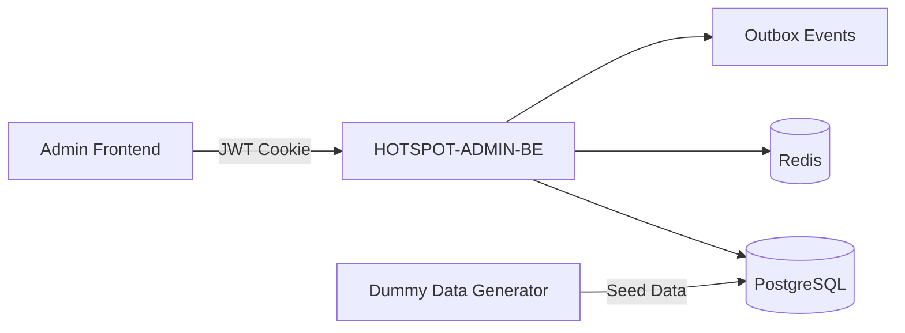
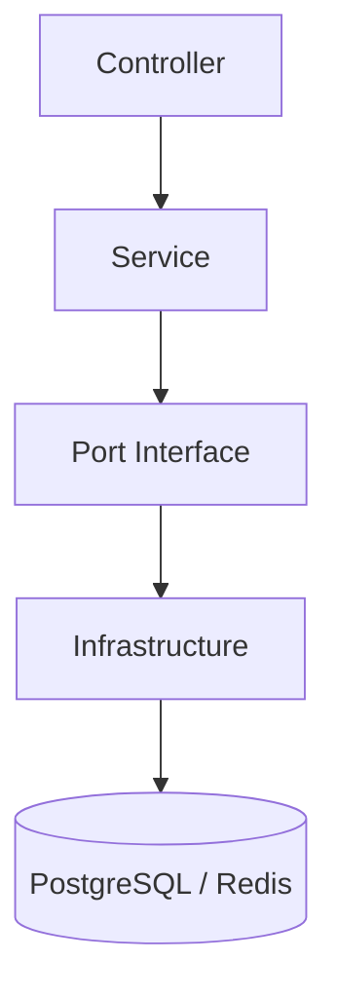

# <h1 align="center">HotSpot 🔥</h1>
<p align="center">
  <b>공유는 여기서, 차단은 저기서? NO!!</b>
</p>
<p align="center"><b>가족 데이터 공유 + 사용 제어, 흩어진 기능을 하나의 통합 서비스로</b></p>

<br>

---
<br>

## 📝 Overview
ADMIN-BE 레포지토리는 가족 공유 데이터/차단 정책/사용량을 운영자가 안전하게 관리할 수 있도록 설계된 백엔드입니다.  
대용량 가입자/회선 데이터를 기반으로 가족 조회, 가족 요청 승인, 정책 운영, 사용량 조회, 전화번호 보호 처리, outbox 이벤트 발행까지 운영 시스템의 핵심 흐름을 제공합니다.

<br>

## 📌 목차
[🚀 HotSpot Admin-BE: 관리자 페이지](#admin)
  - [📖 개요](#admin-overview)
  - [👥 관리자 권한 및 역할](#admin-role)
  - [✨ 현재 제공 기능](#admin-mvp)
  - [🛠️ 핵심 운영 정책](#admin-policy)
  - [🏗️ 기술적 설계](#admin-tech)

[💾 데이터베이스 및 운영 포인트](#db)
  - [기준 데이터 사전](#db-dictionary)

[🚀 관리자 페이지 운영 포인트](#plan)
  - [🎯 정책 운영](#plan-policy)
  - [📡 데이터 운영](#plan-data)
  - [👨‍👩‍👧 가족 운영](#plan-family)
  - [🔔 인증 및 알림](#plan-notification)

<br>

---
<br>

<a id="admin"></a>
## 🚀 HotSpot Admin-BE: 관리자 페이지

**가족 운영, 정책 운영, 사용량 운영을 통합하는 핵심 관리자 API 서비스**

<br>

<a id="admin-overview"></a>
## 📖 개요
서비스의 **운영자 접점(Admin Web)을 지원하는 백엔드 서버**

### 1) 주요 역할
* 관리자 로그인 및 JWT 쿠키 기반 인증
* 가족 목록/검색/요약 조회
* 가족 구성원별 제어 상태 및 정책 적용 상태 관리
* 시간 정책 / 앱 정책 생성, 조회, 활성화/비활성화, 삭제
* 가족 생성/추가/삭제 요청 조회 및 승인/반려
* 가족/회선 단위 데이터 사용량 조회

### 2) 설계 지향점
* **운영 정합성 중심**: 가족 정책, 요청 승인, 정책 활성 상태를 실제 운영 규칙에 맞춰 연결
* **개인정보 보호**: 전화번호는 해시 기반 검색 + 복호화 후 마스킹 응답
* **실데이터 대응 암호화**: `subscription_key` 기반 DEK 복호화 구조 적용
* **읽기 성능 고려**: 가족 목록/요약/검색 쿼리 최적화 및 인덱스 전략 반영
* **확장 가능한 구조**: Controller / Service / Port / Infrastructure 분리

<br>

---
<br>

<a id="admin-role"></a>
## 👥 관리자 권한 및 역할
민감 액션은 정합성과 추적 가능성을 전제로 운영합니다.

### 🛡️ 1) ADMIN
* 관리자 코드 기반 로그인
* 가족 조회 및 전화번호 기반 검색
* 가족 구성원 제어 상태 수정
* 가족 구성원 시간/앱 정책 적용 상태 수정
* 정책 생성/활성화/비활성화/삭제
* 가족 생성/추가/삭제 요청 승인 및 반려

<br>

---
<br>

<a id="admin-mvp"></a>
## ✨ 현재 제공 기능

### 1) 인증
* 관리자 로그인
* JWT access token 발급
* `HttpOnly` 쿠키 기반 인증

### 2) 가족 운영
* 가족 목록 조회
* 가족 상세 요약 조회
* 전화번호 기반 가족 검색
* 가족 제어 상태 조회
* 구성원별 데이터 한도 / 차단 상태 / 역할 수정
* 가족 우선순위 타입(FIFO / PRIORITY) 수정

### 3) 정책 운영
* 시간 정책 목록 조회
* 앱 정책 목록 조회
* 시간 정책 생성
* 앱 정책 생성
* 정책 활성 / 비활성 변경
* 정책 삭제

### 4) 가족 정책 적용
* 구성원별 시간 정책 적용 현황 조회
* 구성원별 앱 정책 적용 현황 조회
* 구성원별 시간 정책 적용 여부 수정
* 구성원별 앱 정책 적용 여부 수정

### 5) 가족 요청 운영
* 가족 생성/추가/삭제 요청 목록 조회
* 요청 승인 / 반려

### 6) 사용량 운영
* 가족 단위 사용량 조회
* 회선 단위 사용량 조회
* Redis 기반 사용량/선물 데이터 집계 조회

<br>

---
<br>

<a id="admin-policy"></a>
## 🛠️ 핵심 운영 정책

### 1) 정책 2계층 관리
* **템플릿 정책(`BLOCK_POLICY`, `APP_BLOCKED_SERVICE`)**: 운영 표준 정책 등록/관리
* **회선 적용 정책(`POLICY_SUB`, `BLOCKED_SERVICE_SUB`)**: 실제 구성원별 정책 활성 상태 반영

### 2) 가족 요청 승인 워크플로우
* 요청 상태: `PENDING`, `APPROVED`, `REJECTED`, `CANCELED`
* 요청 목록은 현재 `family_apply_id` 기준 오름차순 정렬
* 승인/반려는 가족 운영 데이터와 후속 처리 흐름으로 이어짐

### 3) 개인정보 보호 정책
* 전화번호는 `phone_enc` + `phone_hash` 구조
* 검색은 해시 기반
* 응답 표시는 복호화 후 마스킹
* 복호화는 `decryptPhone(encryptedPhone, subId)` 구조 사용

### 4) 전화번호 암호화 운영 규칙
* `subscription.phone_key_bucket_id`, `subscription.phone_key_version` 사용
* `subscription_key(bucket_id, key_version, encrypted_dek, kek_key_id, status)` 참조
* `ENCRYPTION_PROVIDER=local|kms` 분기 지원
* `gcm:` prefix 우선 복호화
* legacy CBC fallback 지원

### 5) 앱 정책 활성 상태 연동
* 비활성 앱 정책은 가족 정책 조회 결과에서 제외
* 비활성 앱 정책은 가족 정책 적용 대상으로 인정하지 않음
* 앱 정책 비활성화 시 기존 `blocked_service_sub` 연결도 일괄 비활성화

<br>

---
<br>

<a id="admin-tech"></a>
## 🏗️ 기술적 설계

### 시스템 아키텍처


### 레이어 구조


### 기술 스택
* Java 17
* Spring Boot 3
* Spring Web / Validation / Security
* Spring Data JPA / Redis
* PostgreSQL
* Redis
* JWT
* AWS SDK KMS
* JUnit5 / Mockito

<br>

---
<br>

<a id="db"></a>
## 💾 데이터베이스 및 운영 포인트

```mermaid
erDiagram
    MEMBER{
        BIGINT member_id PK
        VARCHAR(10) name
        VARCHAR(6) birth
        VARCHAR(10) status
        BOOL is_deleted
        DATETIME created_time
        DATETIME modified_time
    }

    FAMILY {
        BIGINT family_id PK
        INTEGER family_num
        BIGINT family_data_amount
        ENUM priority_type
        BOOL is_deleted
        DATETIME created_time
        DATETIME modified_time
    }

    FAMILY_SUB {
        BIGINT family_sub_id PK
        BIGINT sub_id FK
        BIGINT family_id FK
        ENUM family_role
        INTEGER priority
        BIGINT data_limit
    }

    SUBSCRIPTION {
        BIGINT sub_id PK
        BIGINT plan_id FK
        BIGINT member_id FK
        VARCHAR(255) phone_enc
        VARCHAR(64) phone_hash
        INTEGER phone_key_bucket_id
        INTEGER phone_key_version
        BOOL is_locked
        BOOL is_deleted
        DATETIME created_time
        DATETIME modified_time
    }

    SUBSCRIPTION_KEY {
        BIGINT subscription_key_id PK
        INTEGER bucket_id
        INTEGER key_version
        TEXT encrypted_dek
        VARCHAR(255) kek_key_id
        VARCHAR(20) status
        DATETIME created_time
        DATETIME modified_time
    }

    PLAN {
        BIGINT plan_id PK
        VARCHAR(20) plan_name
        BIGINT plan_data_amount
        VARCHAR(10) data_period
        BOOL is_deleted
        DATETIME created_time
        DATETIME modified_time
    }

    SOCIAL_ACCOUNT {
        BIGINT social_account_id PK
        BIGINT member_id FK
        VARCHAR(50) email
        VARCHAR(50) social_id
        VARCHAR(10) provider
        BOOL is_deleted
        DATETIME created_time
        DATETIME modified_time
    }

    APP_BLOCKED_SERVICE {
        BIGINT app_blocked_service_id PK
        VARCHAR(30) blocked_service_name
        VARCHAR(30) blocked_service_code
        BOOL is_active
        BOOL is_deleted
    }

    BLOCKED_SERVICE_SUB {
        BIGINT blocked_service_sub_id PK
        BIGINT sub_id FK
        BIGINT blocked_service_id FK
        BOOL is_active
    }

    BLOCK_POLICY {
        BIGINT block_policy_id PK
        VARCHAR(30) policy_name
        ENUM policy_type
        JSON policy_snapshot
        BOOL is_active
        BOOL is_deleted
    }

    POLICY_SUB {
        BIGINT policy_sub_id PK
        BIGINT sub_id FK
        BIGINT block_policy_id FK
        BOOL is_active
    }

    FAMILY_APPLY {
        BIGINT family_apply_id PK
        BIGINT requester_sub_id FK
        BIGINT family_id FK
        ENUM apply_type
        VARCHAR(255) doc_url
        ENUM status
        DATETIME created_time
        DATETIME modified_time
    }

    FAMILY_APPLY_TARGET {
        BIGINT family_apply_target_id PK
        BIGINT family_apply_id FK
        BIGINT target_sub_id FK
        ENUM target_family_role
    }

    FAMILY_REMOVE_SCHEDULE {
        BIGINT family_remove_schedule_id PK
        BIGINT target_sub_id FK
        BIGINT family_id FK
        ENUM status
        DATE schedule_date
        DATETIME created_time
        DATETIME modified_time
    }

    NOTIFICATION {
        BIGINT notification_id PK
        BIGINT sub_id FK
        VARCHAR(50) notification_type
        VARCHAR(100) notification_title
        VARCHAR(200) notification_content
        DATETIME created_time
        BOOL is_read
        VARCHAR(100) event_id
    }

    NOTIFICATION_ALLOW {
        BIGINT notification_allow_id PK
        BIGINT sub_id FK
        VARCHAR(20) notification_category
        BOOL notification_allow
        BOOL is_deleted
        DATETIME created_time
        DATETIME modified_time
    }

    PRESENT_DATA {
        BIGINT present_data_id PK
        BIGINT target_sub_id FK
        BIGINT provide_sub_id FK
        BIGINT data_amount
        DATETIME created_time
    }

    MEMBER ||--o{ SUBSCRIPTION : owns
    MEMBER ||--o{ SOCIAL_ACCOUNT : has
    PLAN ||--o{ SUBSCRIPTION : provides
    FAMILY ||--o{ FAMILY_SUB : has
    SUBSCRIPTION ||--o{ FAMILY_SUB : mapped
    SUBSCRIPTION ||--o{ NOTIFICATION : receives
    SUBSCRIPTION ||--o{ NOTIFICATION_ALLOW : configures
    SUBSCRIPTION ||--o{ PRESENT_DATA : target_sub
    SUBSCRIPTION ||--o{ PRESENT_DATA : provide_sub
    SUBSCRIPTION ||--o{ POLICY_SUB : applies
    BLOCK_POLICY ||--o{ POLICY_SUB : mapped
    SUBSCRIPTION ||--o{ BLOCKED_SERVICE_SUB : applies
    APP_BLOCKED_SERVICE ||--o{ BLOCKED_SERVICE_SUB : mapped
    FAMILY ||--o{ FAMILY_APPLY : owns
    FAMILY_APPLY ||--o{ FAMILY_APPLY_TARGET : has
    SUBSCRIPTION ||--o{ FAMILY_APPLY : requester
    SUBSCRIPTION ||--o{ FAMILY_APPLY_TARGET : target
    FAMILY ||--o{ FAMILY_REMOVE_SCHEDULE : schedules
    SUBSCRIPTION ||--o{ FAMILY_REMOVE_SCHEDULE : target
```



<a id="db-dictionary"></a>
### 기준 데이터 사전

#### 요금제
| 요금제명 | 데이터 제공량 | 제공량 기준 |
| --- | --- | --- |
| 5G 시그니처 | 무제한 | MONTH |
| 5G 스탠다드 | 150GB | MONTH |
| 5G 베이직+ | 24GB | MONTH |
| LTE 데이터 33 | 1.5GB | MONTH |
| LTE 다이렉트 45 | 1GB | DAY |

#### 앱 서비스
| 서비스명 | 서비스 코드 |
| --- | --- |
| 카카오톡 | `MSG_KAKAO` |
| 라인 | `MSG_LINE` |
| YouTube | `MEDIA_YOUTUBE` |
| Netflix | `MEDIA_NETFLIX` |
| 치지직 | `MEDIA_CHZZK` |
| SOOP | `MEDIA_SOOP` |
| Instagram | `SNS_INSTAGRAM` |
| TikTok | `SNS_TIKTOK` |
| Facebook | `SNS_FACEBOOK` |
| EBS | `STUDY_EBS` |
| 메가스터디 | `STUDY_MEGA` |
| 업비트 | `FIN_UPBIT` |
| 키움증권 | `FIN_KIWOOM` |
| Chrome | `WEB_CHROME` |
| Safari | `WEB_SAFARI` |
| 롤토체스 | `GAME_TFT` |
| 배틀그라운드 | `GAME_PUBG` |
| 네이버 웹툰 | `TOON_NAVER` |
| 카카오 웹툰 | `TOON_KAKAO` |

#### 정책 템플릿 예시
| 정책명 | 설명 | 정책 유형 | 정책 스냅샷 |
| --- | --- | --- | --- |
| 수면 모드 | 매일 지정한 수면 시간 동안 앱 사용을 제한해 규칙적인 생활을 돕는 정책입니다. | `SCHEDULED` | `{"days":["MONDAY","TUESDAY","WEDNESDAY","THURSDAY","FRIDAY","SATURDAY","SUNDAY"],"startTime":"00:00","endTime":"07:00"}` |
| 방해 금지 모드 | 일정 시간 동안 즉시 앱 사용을 차단해 집중이 필요한 순간을 지원하는 정책입니다. | `ONCE` | `{"durationMinutes":180}` |
| 수업 집중 모드 | 평일 수업 시간에 맞춰 앱 사용을 자동 제한해 학습 집중도를 높이는 정책입니다. | `SCHEDULED` | `{"days":["MONDAY","TUESDAY","WEDNESDAY","THURSDAY","FRIDAY"],"startTime":"09:00","endTime":"14:00"}` |
| 시험 기간 집중 모드 | 시험 대비 기간에 장시간 앱 사용을 제한해 학습 몰입을 강화하는 정책입니다. | `ONCE` | `{"startTime":"06:00","endTime":"23:59"}` |

#### 운영 포인트
* `.generator-dummy` 기준 총 사용자 1,000,000명 / 가족 250,000개 데이터를 기준으로 구성
* 가족 구성은 2~8인, 역할은 `OWNER / PARENT / CHILD`
* 가족 데이터 공유 정책은 `FIFO` 또는 `PRIORITY`
* 정책 템플릿은 관리자 템플릿 복사 / 커스터마이즈 / 신규 생성 방식으로 가족에 매핑
* 실데이터 정합성을 위해 `subscription_key` 기반 복호화 사용

<br>

---
<br>

<a id="plan"></a>
## 🚀 관리자 페이지 운영 포인트

<a id="plan-policy"></a>
### 🎯 1) 정책 운영
* 시간 정책 / 앱 정책을 별도 템플릿으로 운영
* 정책 활성 / 비활성 상태를 가족 적용 조회와 연결
* 앱 정책 비활성화 시 가족 적용 데이터까지 함께 정리

<a id="plan-data"></a>
### 📡 2) 데이터 운영
* 가족 단위 / 회선 단위 사용량 조회 지원
* Redis 기반으로 사용량 데이터를 빠르게 조회
* 선물 데이터와 요금제 데이터량을 함께 계산

<a id="plan-family"></a>
### 👨‍👩‍👧 3) 가족 운영
* 가족 목록 / 요약 / 검색 지원
* 가족 상세 제어 상태 및 정책 상태 조회 지원
* 가족 생성/추가/삭제 요청 승인 흐름 지원
* 가족 구성원별 차단/한도/우선순위 수정 지원

<a id="plan-notification"></a>
### 🔔 4) 인증 및 알림
* 관리자 로그인은 JWT 쿠키 기반으로 동작
* outbox 기반 후속 이벤트 발행 구조 포함
* 운영 환경에서는 쿠키 domain / secure / sameSite / CORS 정합성 점검 필요

<br>

---
<br>

## ▶️ 실행 방법

### 1) 애플리케이션 실행
```bash
./gradlew bootRun
```

### 2) 컴파일
```bash
./gradlew compileJava --no-daemon
```

### 3) 테스트
```bash
./gradlew test --no-daemon
```

### 4) Swagger
* `/swagger-ui/index.html`

<br>

---
<br>

## ✨ 한 줄 정리
이 프로젝트는 **가족 운영, 정책 운영, 사용량 운영, 개인정보 보호를 실제 운영 규칙에 맞춰 묶어낸 관리자 백엔드**입니다.
